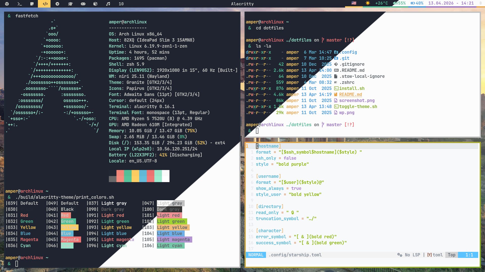

# My Ayu Themed Arch Linux Dotfiles 🎨




A collection of my personal dotfiles for a consistent and beautiful Ayu-themed experience on Arch Linux with the Niri compositor.

On the fly Light/Dark theme switch included (Experimental).

## 🚀 Installation

1.  Clone the repository:
    ```bash
    git clone https://github.com/Andrey0189/arch-dotfiles
    cd arch-dotfiles
    ```
2.  Run the installation script:
    ```bash
    ./install.sh
    ```

    > **Note:** You must install the Tmux Plugin Manager manually:
    > ```bash
    > mkdir -p ~/.config/tmux/plugins && git clone https://github.com/tmux-plugins/tpm ~/.config/tmux/plugins/tpm
    > ```

The script will back up your existing configuration files to `~/.config/filename.bak` and `~/.zshrc.bak` before copying the new files.

## 🪟 Window Manager: Niri

[Niri](https://github.com/YaLTeR/niri) is a scroll-stacking Wayland compositor. It's unique, fast, and highly configurable.

### Keybindings ⌨️ (Compact)

| Action | Bind | Action | Bind |
| :--- | :--- | :--- | :--- |
| **Terminal** | `Mod+Shift+Enter` | **Close Window** | `Mod+Shift+C` |
| **App Menu** | `Mod+D` | **Fullscreen** | `Mod+Shift+F` |
| **Notifications** | `Mod+N` | **Floating** | `Mod+V` |
| **Lock Screen** | `Alt+Super+L` | **Focus (L/D/U/R)** | `Mod + Arrows` |
| **Workspace 1-9** | `Mod + 1-9` | **Move Window** | `Mod+Shift + Arrows` |
| **Overview** | `Mod+O` | **Resize Width** | `Mod + (-/=)` |
| **Maximize to edges** | `Mod+M` | **Screenshot** | `Print` |

## 🐚 Shell

### Zsh ⚡

- `.zshrc` configured for an enhanced interactive experience.
- `autocd`, `correct` options for convenience.
- Useful aliases like `ls='eza --icons always'` and `v='nvim'`.

### Starship Prompt 🚀

- A minimal, blazing-fast, and infinitely customizable prompt for any shell.
- Shows username, hostname and other useful stuff, like Python version in your current environment.

## 💻 Multiplexer: Tmux

[Tmux](https://github.com/tmux/tmux/wiki) is a terminal multiplexer.

### Keybindings ⌨️

| Keybinding            | Description                                     |
| :-------------------- | :---------------------------------------------- |
| `Alt + r`             | Reload config                                   |
| `Alt + s`             | Choose session/window tree                      |
| `Alt + [1-9]`         | Select window                                   |
| `Alt + (←,→,↑,↓)`     | Select pane                                     |
| `Alt + Shift + (←,→,↑,↓)` | Resize pane                                 |
| `Alt + h`             | Split window vertically                         |
| `Alt + v`             | Split window horizontally                       |
| `Alt + Enter`         | New window                                      |
| `Alt + c`             | Kill pane                                       |
| `Alt + q`             | Kill window                                     |
| `Alt + d`             | Detach                                          |
| `Alt + Q`             | Kill session                                    |
| `Alt + /`             | Search forward                                  |
| `Alt + ?`             | Search backward                                 |

## 🖥️ Applications configured

- 🚄 **[Alacritty](https://alacritty.org/):** GPU-accelerated terminal with **Ayu** (Light/Mirage) themes.
- 📊 **[Waybar](https://github.com/Alexays/Waybar):** Highly customizable bar with dynamic Ayu color schemes.
- 📨 **[Swaync](https://github.com/ErikReider/SwayNotificationCenter):** A simple notification daemon for Wayland, themed with Gruvbox.
- 🔒 **[Hyprlock](https://hyprland.org/docs/ecosystem/hyprlock/):** The official screen locker for Hyprland, showing a blurred background and the current time.
- 📁 **[Ranger](https://github.com/ranger/ranger):** A console file manager with VI key bindings and image previews.
- 📖 **[Zathura](https://pwmt.org/projects/zathura/):** A highly customizable document viewer with VI-like keybindings and a Gruvbox theme.
- 🦇 **[Bat](https://github.com/sharkdp/bat):** A `cat(1)` clone with wings for syntax highlighting.
